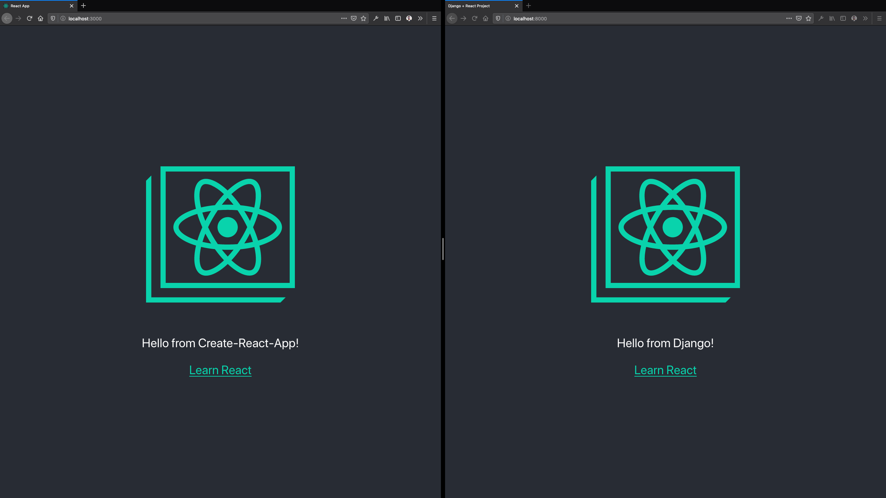

<!-- omit in toc -->
# django-cra-helper

[](https://pypi.org/project/django-cra-helper/)

- [Introduction](#introduction)
- [Installation](#installation)
- [Configuration](#configuration)
  - [1. settings.py](#1-settingspy)
  - [2. urls.py](#2-urlspy)
  - [3. asset-manifest.json](#3-asset-manifestjson)
- [Development](#development)
- [Production](#production)
  - [Supporting CRA's relative paths](#supporting-cras-relative-paths)
- [React in Django templates](#react-in-django-templates)
  - [Specifying React Components via template context](#specifying-react-components-via-template-context)
  - [Referencing React static files](#referencing-react-static-files)
- [The Payoff Revealed](#the-payoff-revealed)

## Introduction

**django-cra-helper** is the missing link between **Django** and **create-react-app**. By adding this to your Django project, you can almost effortlessly inject your React components into your Django templates and initialize component props via Django context variables.

The ultimate goal of this package is to integrate these two projects with minimal changes to workflows that are typically used with either during development. From `npm start` to `python manage.py collectstatic`, your commands should work as expected so you can forget about implementation and get back to development!

> Note: For the purposes of this README, the abbreviation **CRA** will be used to refer to **create-react-app**.

## Installation

This package is available for installation via `pip`:

```sh
pip install django-cra-helper
```

## Configuration

### 1. settings.py

Once **django-cra-helper** is installed, `cra_helper` will need to be added to `INSTALLED_APPS` in `settings.py`:

```python
INSTALLED_APPS = [
    'django.contrib.admin',
    'django.contrib.auth',
    'django.contrib.contenttypes',
    'django.contrib.sessions',
    'django.contrib.messages',
    'cra_helper',
    'django.contrib.staticfiles',
]
```

> Note: `cra_helper` **must** be placed above `django.contrib.staticfiles` in the list!

Add `cra_helper.context_processors.static` to `TEMPLATES['OPTIONS']['context_processors']`:

```python
TEMPLATES = [
    {
        # ...snip...
        'OPTIONS': {
            'context_processors': [
                # ...snip...
                'cra_helper.context_processors.static',
            ],
        },
    },
]
```

Additionally, the following `STATICFILES_FINDERS` list will also need to be added to `settings.py`:

```python
STATICFILES_FINDERS = [
    # Django defaults
    'django.contrib.staticfiles.finders.FileSystemFinder',
    'django.contrib.staticfiles.finders.AppDirectoriesFinder',
    # A finder to pull in asset-manifest.json
    'cra_helper.finders.CRAManifestFinder',
]
```

The last necessary setting is the name of the folder containing the CRA project files, relative to the base directory of the Django **project** (the folder containing `manage.py`):

```python
CRA_APP_NAME = 'cra-app'
```

If for some reason the CRA liveserver does *not* serve on localhost or port 3000, the following settings can be added to `settings.py` to specify its actual host and port:

```python
CRA_HOST = '0.0.0.0' # defaults to 'localhost'
CRA_PORT = 9999      # defaults to 3000
```

### 2. urls.py

Hot-reloading support can be enabled by first adding the following to your project or app's **urls.py** file:

```python
# import Django settings
from django.conf import settings
# add `re_path` import here
from django.urls import path, re_path
# ...other imports...

from cra_helper.views import proxy_cra_requests

# other existing urls
urlpatterns = [...]

# add a reverse-proxy view to help React in the Django view talk to Create-React-App
if settings.DEBUG:
    proxy_urls = [
        re_path(r'^__webpack_dev_server__/(?P<path>.*)$', proxy_cra_requests),
    ]
    urlpatterns.extend(proxy_urls)
```

Next, follow the instructions below that correspond to your project's version of `react-scripts`:

<details>
  <summary>For projects using <strong>react-scripts@&lt;3.3.0</strong></summary>

  Add one more url to `proxy_urls` above:

  ```python
  proxy_urls = [
      # ...snip...
      re_path(r'^sockjs-node/(?P<path>.*)$', proxy_cra_requests),
  ]
  ```
</details>

<details>
  <summary>For projects using <strong>react-scripts@&gt;=3.3.0</strong></summary>

  Create an **.env** file in the root of your Create-React-App folder with the following environment variable:

  ```
  WDS_SOCKET_PORT=3000
  ```
</details>

### 3. asset-manifest.json

Finally, run CRA's `npm run build` command once to generate a `build/` directory. **django-cra-helper** requires the **build/asset-manifest.json** file contained within to help load non-JS and non-CSS assets that might be used in any React components. This command should be re-run any time a new non-JS or non-CSS asset is added to the project.

## Development

If the CRA project's liveserver is started via `npm start` prior to starting Django's development server via `python manage.py runserver`, code changes in the React codebase will be updated immediately within Django views as well.

When the CRA liveserver is running, **django-cra-helper** adds a `bundle_js` array template variable that can be inserted into the Django view's template to load the liveserver's various files containing all of the current JS and CSS. These files are recompiled on-the-fly by the liveserver whenever edits are made to the React code. This file can be added to a Django template as follows:

```html

  
<script type="text/javascript" src="{{ file_url }}"></script>
  

```
> Note: Don't use the `static` template tag here! This file needs to be loaded from the CRA liveserver instead.

## Production

**django-cra-helper** also takes care of ensuring that Django's `collectstatic` command pulls in production-ready bundles built by CRA's `npm run build` command.

First, prepare React files for production with the typical CRA `npm` build command:

```sh
npm run build
```

This will output bundled, minified JavaScript and CSS, and assets to the `/build/` folder within the CRA project folder.

Once this command is complete, run the following Django command to gather static files, including the compiled React assets:

```sh
python manage.py collectstatic --no-input
```

React assets will be included with the other static assets in the `settings.STATIC_ROOT` directory, to be served as is usual in a Django production environment. An `asset-manifest.json` file will also get pulled in. The contents of this CRA-generated file are required by **django-cra-helper** to help reference React files that have had a unique hash added to their filenames during the build process.

Similar to the `bundle_js` template variable mentioned earlier, **django-cra-helper** includes numerous other template variables when the CRA liveserver is _not_ running:

<details>
  <summary>For older projects using <strong>react-scripts@&lt;=2.1.8</strong></summary>

  The two most important variables are `main_js` and `main_css`. These can be injected into the page via a typical call to `` in the template:

  ```html
  
  <link href="" rel="stylesheet">
  
  ```
  ```html
  
  <script type="text/javascript" src=""></script>
  
  ```

  > NOTE: Recent attempts at building a fresh CRA project with `react-scripts@2.1.8` were unsuccessful in recreating SPAs that allowed for just a single `main_js`. `npm run build`-produced artifacts functioned almost identically to artifacts generated the same as `react-scripts@3.1.2`, detailed below.
  >
  > There may be child dependencies of `react-scripts` that make it no longer possible to start apps that will function with the above instructions. In these cases, please try the instructions in the next section.
</details>

<details>
  <summary>For projects using <strong>react-scripts@&gt;=3.0.0 to react-scripts@&lt;3.2.0</strong></summary>

  Code-splitting was introduced in later versions of `react-scripts` that split up `main_js` into multiple files. Additional `<script>` tags are required to enable the React project to load. Depending on the size of your project, in addition to `main_js` mentioned above you'll need to add at least two more in a specific order:

  ```html
  
  <script type="text/javascript" src=""></script>
  <script type="text/javascript" src=""></script>
  <script type="text/javascript" src=""></script>
  
  ```

  The naming of `static_js_2_9a95e042_chunk_js` above will differ from project to project. Unfortunately you'll have to manually confirm this value in your project's **asset-manifest.json** and update accordingly. It doesn't seem to change between builds, though, so it may not be a value you need to regularly update...
</details>

<details>
  <summary>For projects using <strong>react-scripts@&gt;=3.2.0</strong></summary>

  Starting with `react-scripts@3.2.0`, a new `entrypoints` property can be found in **asset-manifest.json**. This contains an array of files that **django-cra-helper** makes available in templates to more easily inject these files via new `entrypoints.css` and `entrypoints.js` arrays. These **replace** the `main_css` and `main_js` values used above:

  ```html
  
  <link href="" rel="stylesheet">
  
  ```
  ```html
  
  <script type="text/javascript" src=""></script>
  
  ```

  > NOTE: These JavaScript and CSS files should be arranged in an order required for the site to load; the ultimate order is derived from the order present in **asset-manifest.json**.
</details>

### Supporting CRA's relative paths

CRA allows developers to specify a [relative sub-folder for their site to be hosted from](https://create-react-app.dev/docs/deployment/#building-for-relative-paths) via the `"homepage"` property in **package.json**:

```json
{
  "name": "cra-app",
  "version": "0.1.0",
  "homepage": "/frontend",
  ...
}
```

When this value is set, `npm run build` will output assets and an **asset-manifest.json** with paths prepended with the path prefix:

```
Before: /static/js/main.319f1c51.chunk.js
After:  /frontend/static/js/main.319f1c51.chunk.js
```

**To make sure the React imports/assets/etc... can be found even when hosted through Django, you'll also need to update `STATIC_URL` in Django's settings.py to include the path prefix:**

```py
STATIC_URL = '/frontend/static/'
```

Once these changes are made then the React app should be able to find everything it needs to function.

## React in Django templates

### Specifying React Components via template context

The CRA project will need to undergo a small bit of re-architecture to prepare it to accept input values via context when Django serves the view. The following is an example of how a couple of small tweaks to a CRA project's **src/index.js** file will establish a simple API for Django to communicate with the bundled React codebase:

```js
import React from 'react';
import ReactDOM from 'react-dom';
import App from './App';
import './index.css';

/**
 * Maintain a simple map of React components to make it easier
 * for Django to reference individual components
 */
const pages = {
  App,
}

/**
 * If Django hasn't injected these properties into the HTML
 * template that's loading this script then we're viewing it
 * via the create-react-app liveserver
 */
window.component = window.component || 'App';
window.props = window.props || { env: 'Create-React-App' };
window.reactRoot = window.reactRoot || document.getElementById('root');

/**
 * React the component as usual
 */
ReactDOM.render(
  React.createElement(pages[window.component], window.props),
  window.reactRoot,
);
```

Basically, `index.js` is updated to read values set to `window.component`, `window.props`, and `window.reactRoot` and use these to render a component. Each of these three "inputs" will allow Django to easily specify which component to initialize on a per-view basis:

* `window.component`: A **string** that points to a Component entry in `pages`
* `window.props`: An **Object** containing props to get passed into the Component
* `window.reactRoot`: an **instance** of `document.getElementById`

> Note: Settings these values is optional. The defaults specified in the template above enable components to render as expected when viewed from the CRA liveserver.

Now that the "API" is in place, Django Views can include values for these inputs via the context they pass to their template:

```python
def index(request):
    context = {
        'component': 'App',
        'props': {
            'env': 'Django',
        },
    }
    return render(request, 'index.html', context)
```

Below is the Django app view's `index.html` template that can render across multiple versions of `react-scripts` (intended only for demo purposes with a fresh CRA app):

```html


<!DOCTYPE html>
<html lang="en">

  <head>
    <meta charset="UTF-8">
    <meta name="viewport" content="width=device-width, initial-scale=1.0">
    <meta http-equiv="X-UA-Compatible" content="ie=edge">
    
      
    <link href="" rel="stylesheet">
      
    
    <link href="" rel="stylesheet">
    
    <title>Django + React Project</title>
  </head>

  <body>
    <div id="react">Loading...</div>

    <script>
      window.component = '{{ component }}';
      window.props = {{ props | json }};
      window.reactRoot = document.getElementById('react');
    </script>
    
      
    <script type="text/javascript" src="{{ file }}"></script>
      
    
      
    <script type="text/javascript" src=""></script>
      
    
    <script type="text/javascript" src=""></script>
    {# make sure to update this accordingly according to asset-manifest.json #}
    <script type="text/javascript" src=""></script>
    <script type="text/javascript" src=""></script>
    
  </body>

</html>
```
The context's `component` and `props` are bound to `window.component` and `window.props` respectively.

Note the use of the `json` filter when setting `windows.props`! `` provides this filter as a way to easily sanitize and convert a Python `dict` to a Javascript `Object`. The View context prepared above thus renders to the following typical Javascript Object:

```js
// This is what is returned in the rendered HTML
window.props = {"env": "Django"};
```
Finally, `window.reactRoot` specifies the container element that the React component should be rendered into. Setting a value for this is only required if the container's `id` is *not* **"root"** (the same ID assigned to the container `<div>` in the CRA project's `index.html`.)

### Referencing React static files

Other assets bundled by CRA, including image assets, can be accessed in templates by substituting `/`, `.`, `~`, and `-` in their filepaths with `_`. **django-cra-helper** adds every entry in **asset-manifest.json** to the base context, using these substitution rules to accomodate Django's `static` tag.

For example, a **logo.svg** file in the CRA project can be included in a Django template as follows:

```html
<!-- This file is located at `/build/static/media/logo.svg` -->

```
> Note: This is optional! Static assets can still be included in the Django app's `/static/` directory and loaded as usual. The special substitution mentioned above is only needed when reusing React assets outside of specific components.

## The Payoff Revealed

When all is said and done, React components should now render and be viewable in both the CRA liveserver and when served via Django. Here's an example of a slightly-modified CRA `App` component displayed in CRA (left) and Django (right):


